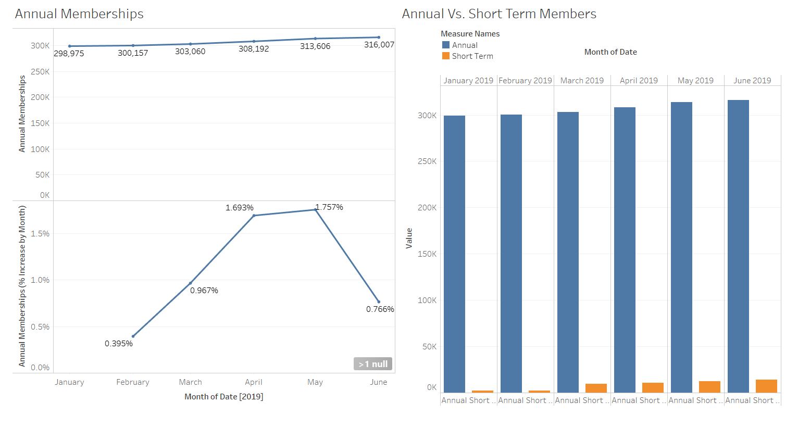
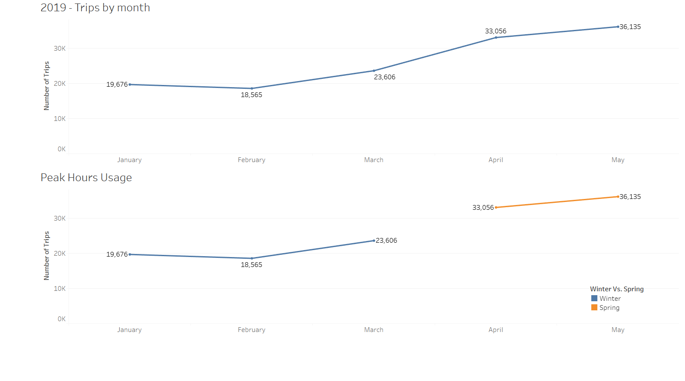
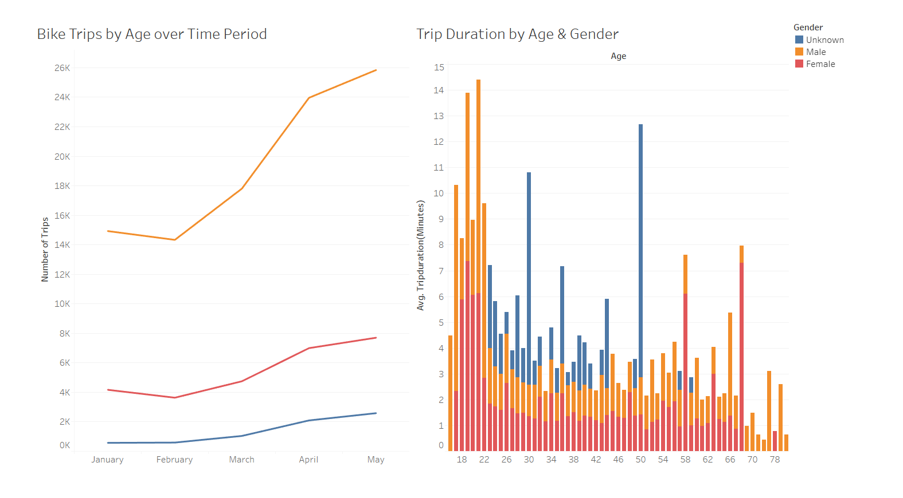
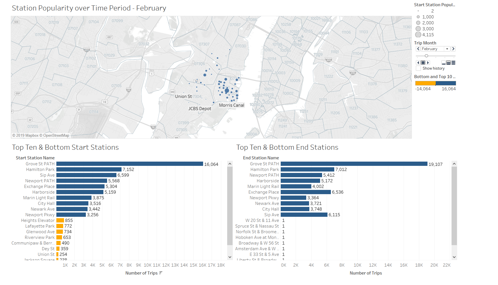

# CityBike Key Hypothesis
Key hypothesisbased on last 6 months Bike Trips:
  1. 90% of the customers are Annual Subscribers Vs.Temporary Bike Riders
  2. Bike Rides increase as weather warms up. This is observed in the% increase of rides as weather transitions month over month from 
     Winter to Spring months
  3. Gender based analysis indicates Male bike Riders are 3.5 times more than Female Bike Riders
  4. It is also observed that Bike rides stations popularity stays consistent across months, though number of Bike Rides increases     
     proportionally across popular Bike Ride Stations, which are near public transportation, such as Path stations or popular pulic places
 

# BikeRides Membership Analysis Dashboard

# CityBikes Usage over months Dashboard

# CityBike Rides by Age and Gender Dashboard

# BikeStations Pupularity Dashboard - Dynamic Map & Top 10/Top Bottom = Start & End Stations

